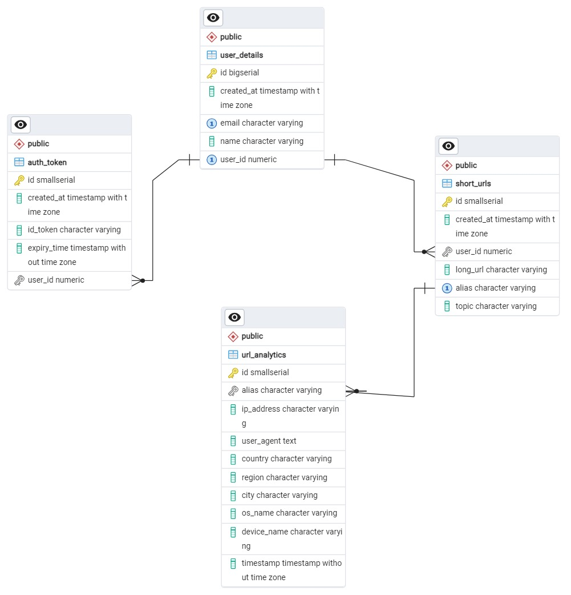

# URL Shortener App

## Overview

This project provides a **URL shortening service** with **analytics** and **Google authentication**. Users can:

- Shorten URLs,
- Track performance (clicks, unique users, device/OS breakdowns),
- Group URLs by topics.

The **Google Sign-In integration** generates **JWT access** and **ID tokens** for secure access. The service includes **rate limiting**, **Redis caching** for improved performance, and detailed **analytics APIs** for both individual URLs and topics.

The service including **PostgreSQL**, **Redis**, and the **server**, is deployed on **OnRender**.

---

## API Endpoints

### 1. User Authentication via Google

- **Endpoint:** `/auth/google`
- **Method:** `GET`
- **Description:** Redirects the user to Google's authentication page for signing in via Google.

### 2. Google Authentication Callback

- **Endpoint:** `/auth/google/callback`
- **Method:** `GET`
- **Description:** Handles the callback from Google, retrieves user credentials, generates JWT tokens (access & refresh), and stores them in the database.

### 3. Create Short URL

- **Endpoint:** `/api/shorten`
- **Method:** `POST`
- **Description:** Creates a new short URL from a long URL, with optional custom alias and topic.

### 4. Redirect to Long URL

- **Endpoint:** `/api/shorten/{alias}`
- **Method:** `GET`
- **Description:** Redirects to the original long URL based on the short URL alias.

### 5. Get URL Analytics

- **Endpoint:** `/api/analytics/{alias}`
- **Method:** `GET`
- **Description:** Fetches analytics (clicks, unique users, OS & device type stats) for a specific short URL.

### 6. Get Topic-Based Analytics

- **Endpoint:** `/api/analytics/topic/{topic}`
- **Method:** `GET`
- **Description:** Fetches analytics for all URLs under a specific topic, including total clicks and unique users.

### 7. Get Overall Analytics

- **Endpoint:** `/api/analytics/overall`
- **Method:** `GET`
- **Description:** Fetches overall analytics for all short URLs created by the authenticated user.

---

## ER-Diagram

## Project Setup

### Environment Variables

- Copy variables from `.env.sample` to `.env` and update them with your credentials.

### Redis & PostgreSQL Setup

Ensure **Redis** and **PostgreSQL** are set up and running locally.

### Docker Setup

#### Build the Docker image

- docker build -t url-shortner-app .

#### Run the Docker container

- docker run -d -p 3001:3001 --name my-container url-shortner-app

### Direct Server Setup

#### Install dependencies

- npm install

#### Start the server

- npm start

## Health Check Endpoint

- **url:** https://url-shortner-09ey.onrender.com/health
- **Endpoint:** `/api/health`
- **Method:** `GET`
- **Description:** Checks the health status of the server, Redis, and PostgreSQL connections.

---

## Swagger Documentation

- **Swagger API Docs:** https://url-shortner-09ey.onrender.com/api-docs
- **Google Authentication URL:** https://url-shortner-09ey.onrender.com/auth/google

### Steps to Run APIs on Swagger

1. **Authenticate via Google:** Go to Authenticate with Google and sign in.
2. **Get Access Token:** After authentication, check the cookies for the access token.
3. **Authorize on Swagger:** In Swagger UI, click "Authorize" and enter the access token from cookies.
4. **Try APIs:** Use the "Try it out" button in Swagger to test the APIs.

---

## Redis Caching

Caching is applied for the following routes:

- `/api/shorten/:alias`: Caches the actual URL data for the alias.
- **Analytics APIs:** Caches analytics data for **5 minutes (300 seconds)**.

---

## Rate Limiting

Rate limiting is implemented using the **express-rate-limit** library to control the number of requests to the server:

- `/api/shorten`: **Rate limited to 10 requests per IP in 10 minutes** for creating short URLs.
- **Analytics APIs:** **Rate limited to 100 requests overall in 10 minutes** for all analytics APIs.

---
